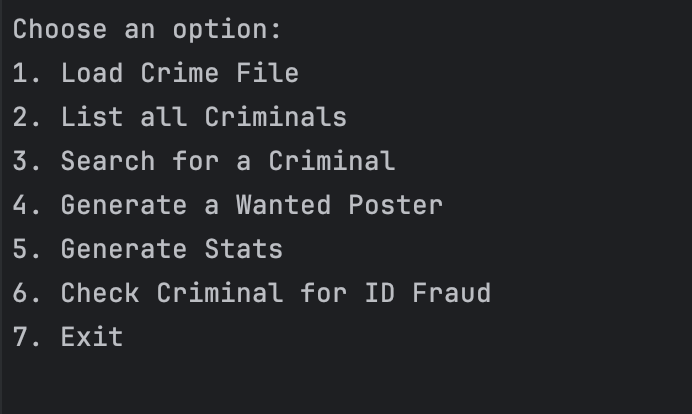

# Criminal-Database-Menu
Hi there! 

This is a Criminal Database Menu with 5 functions including:
1. Feature listing
2. Search functionality
3. Graphical poster generation
4. Analytics presentation
5. Fraud detection

I have included a Makefile. Therefore, in order to let it run, you can type *"make run"* command in your terminal after switch to Source directory.

As the program starts running, you should be able to see an interface like the picture below:

For each option, if you want to choose that one, simply type the number before each option. For instance, if I want to load Crime File, simply type 1 and press Enter.

Before doing search, poster generation and other options, remember to load the dataset. In other words, choose the first option. Otherwise, the dataset is empty.

**Congrats!** 🥰

You have already know how to interact with the database interface! Start type in a option and look around if you want!